# E-Commerce Micro-service App on K8s

I have setup a E-Commerce app on Kubernetes (Hereby referred to as _K8s_) to demonstrate micro-services architechture and best practices around it.

## Table of Contents

[TOC]

## Minikube On Linux

### Installation

To install minikube on a Linux system you can install the official binary using the following commands.

```sh
curl -LO https://storage.googleapis.com/minikube/releases/latest/minikube-linux-amd64
sudo install minikube-linux-amd64 /usr/local/bin/minikube && rm minikube-linux-amd64
```

> If you face any problem in the installation process, please checkout this link
> [minikube installation](https://minikube.sigs.k8s.io/docs/start/?arch=%2Flinux%2Fx86-64%2Fstable%2Fbinary+download).

### Starting Minikube

During this setup, I explored every **runtime driver** of minikube and found that each has its pros and cons.

While using _--container-runtime_ as **docker** I was facing problems while scraping _system metrics_ using **prometheus** and that's why I ended up using _containerd_ with an older version of _kubernetes_. Also, I have allocated more memory and CPU and disk space to my minikube because minikube got stuck if as it didn't have enough resources to spawn my pods.

```sh
minikube start \
    --nodes 3 \
    --cpus 4 \
    --memory 6GB \
    --disk-size 50GB \
    --container-runtime=containerd \
    --kubernetes-version=v1.28.3 \
    --bootstrapper=kubeadm \
    --extra-config=kubelet.authentication-token-webhook=true \
    --extra-config=kubelet.authorization-mode=Webhook \
    --extra-config=scheduler.bind-address=0.0.0.0 \
    --extra-config=controller-manager.bind-address=0.0.0.0
```

> The issue that I was facing the below issue while setting up prometheus in my minikube setup was this [Prometheus_issue](https://github.com/prometheus-community/helm-charts/issues/3614)

Additionally, start the **_minikube tunnel_** (minikube tunnel runs as a process, creating a network route on the host to the service CIDR of the cluster using the cluster's IP address as a gateway. The tunnel command exposes the external IP directly to any program running on the host operating system) to allow our nginx ingress controller's external IP to work.

```sh
minikube tunnel
```

> Also, to work with kubernetes resources we have to install _kubectl_ if you don't installed it yet in your machine.

## Frontend Setup

I wrote a simple frontend using react which fetches the product list from the backend and provides users with **"Buy"** button on clicking which it sends a request to the backend to add an order to the message queue (_RabbitMQ_).

### Docker Image

#### Create the Dockerfile to build our frontend image.

- Inside the dockerfile, we need to do a _npm build_ of our app.
- Additionally, we need _nginx_ to serve the built static single-page app (_SPA_).
- Inside the dockerfile itself we need to set the backend hostname. If we don't specify any backend hostname it will by default work on **localhost:5000**.

```sh
cd frontend
docker build -t e-commerce-depl-frontend:<IMAGE_TAG> --build-arg BACKEND_HOSTNAME=<YOUR_BACKEND_HOSTNAME> .
```

#### Push the image to a registry

I used my DockerHub account for this project.

```sh
docker tag e-commerce-depl-frontend:<IMAGE_TAG> <YOUR_DOCKERHUB_USERNAME>/e-commerce-depl-frontend:<IMAGE_TAG>
docker push <YOUR_DOCKERHUB_USERNAME>/e-commerce-depl-frontend:<IMAGE_TAG>
```

## Backend Setup

For backend, I wrote a simple **_node.js_** app using _express_, _mongoose_ and _amqplib_.

It exposes 3 APIs.
| API | Method | Description |
| -------- | -------- | -------- |
| /api/seed | POST | Seeds the data with some prefilled data. |
| /api/producs | GET | Fetches the list of available products from the database. |
| /api/order | POST | Places the order of a product to the message queue (_RabbitMQ_). |

### Docker Image

#### Create the Dockerfile to build our frontend image.

- We simply do a _npm build_ inside dockerfile.
- And then run _index.js_ file using node package manager as entrypoint executable.

```sh
cd backend
docker build -t e-commerce-depl-backend:<IMAGE_TAG> .
```

#### Push the image to a registry

I used my DockerHub account for this project.

```sh
docker tag e-commerce-depl-backend:<IMAGE_TAG> <YOUR_DOCKERHUB_USERNAME>/e-commerce-depl-backend:<IMAGE_TAG>
docker push <YOUR_DOCKERHUB_USERNAME>/e-commerce-depl-backend:<IMAGE_TAG>
```

## K8s Ingress Setup

I am using Nginx Ingress Controller in my K8s for enabling Ingress.

### Setup Nginx

Quickest way to setup nginx ingress controller is using helm charts. I also used helm chart to deploy _nginx_ in my _minikube_.

```sh
helm repo add ingress-nginx https://kubernetes.github.io/ingress-nginx
helm repo update
helm install nginx ingress-nginx/ingress-nginx -n <YOUR_NAMESPACE>
```

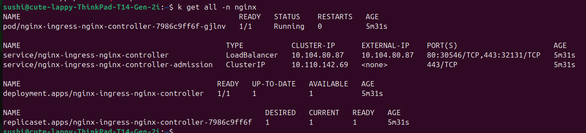

> Note: Without the **_minikube tunnel_** running, the nginx controller external IP will stay in _pending_ state.

Data Storage and Messaging Queue Infrastructure

---

For data storage, I used MongoDB as it provides a quick and easy _NoSQL DB_, ready to use.

### MongoDB Setup

To setup our MongoDB, I have used bitnami helm chart.

> Minikube acts differently depending on the runtime environment we are using. Minikube with docker as runtime works fine while creating any PVC but it will not work if you user your runtime as containerd. The _root cause analysis_ is still pending. I am using additional overrides with the helm chart which works in my case.

```sh
helm install mongo bitnami/mongodb --set auth.username=<MONGODB_USER>,auth.password=<MONGODB_PASSWORD>,auth.database=<MONGODB_DATABASE>,volumePermissions.enabled=true
```

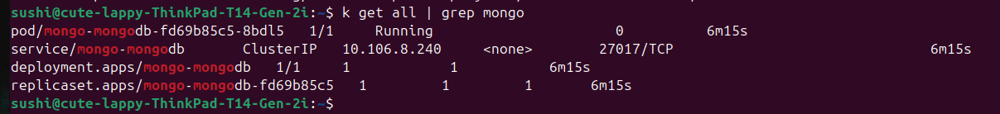

For Messaging queue, I am using RabbitMQ.

### RabbitMQ Setup

Same here, I am using bitnami helm charts to install RabbitMQ.

```sh
helm install rabbitmq bitnami/rabbitmq --set auth.username=<RABBITMQ_USER>,auth.password=<RABBITMQ_PASSWORD>,volumePermissions.enabled=true
```

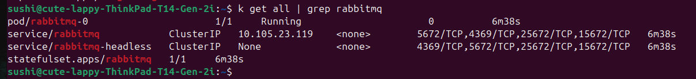

## Micro-service Architecture

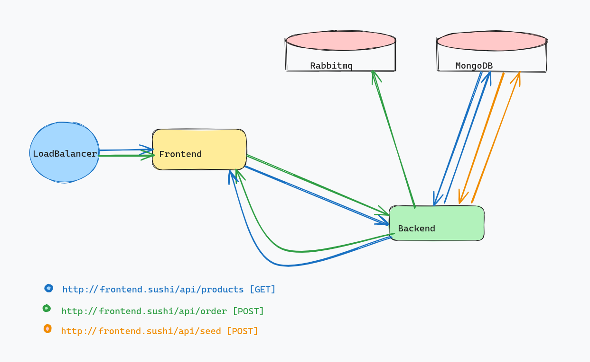

## Setting up Project Secrets

As we are using K8s and different services needs to talk to each other like backend -> [db, queue], the best practice is to have authentication on the backend and queue.

Now, we need the credentials to use these services in our backend. The best way to do this in K8s is through _secrets_.

### Creating the credentials secret

We create a secret to store our databases username and password in one place and we will be using this secret in our backend deployment file to access database and queue's usernames and passwords.

```sh
kubectl create secret generic db-queue-cred \
  --from-literal=MONGO_USER=<MONGO_USER> \
  --from-literal=MONGO_PASSWORD=<MONGO_PASSWORD> \
  --from-literal=RABBITMQ_USER=<RABBITMQ_USER> \
  --from-literal=RABBITMQ_PASSWORD=<RABBITMQ_PASSOWRD>
```

## Deploying our app on K8s

We have created deployment files for both the _frontend_ and _backend_ using the pushed **public** _DockerHub_ images. You should replace the image with your _DockerHub_ image repo and also set the **imagePullPolicy** as _always_ to pull images whenever a restart happen.

Also created a _ClusterIP service_ and _ingress_ file to serve external requests.

Used _nginx_ as **ingress class**. Additionally created a **HPA** to automatically scale up pods in-case of high traffic, based on the CPU utilization.

We mount the MongoDB and RabbitMQ credentials variables from the secret that we have created.

```sh
cd kubernetes
kubectl apply -f frontend/
kubectl apply -f backend/
```


> Note: If you have any problem in any installation process please check pods logs. You can also check logs or describe the deployment/statefulSet and check what is happening.

## Gatekeeper

**_Gatekeeper_** is an admission controller that validates requests to create and update Pods on Kubernetes clusters, using the **Open Policy Agent (OPA)**. Gatekeeper allows administrators to define policies with constraints, which is a set of conditions that permits or denies deployment behaviors in Kubernetes. In our case, I have setup a constraint which says that if you do not specify _resource limits_ {**cpu usage** and **memory usage**} for a pod, Gatekeeper will not allow us to spawn that pod. We have a demo.yaml of a nginx pod you can verify your Gatekeeper using that file.

```sh
cd kubernetes/gatekeeper/
kubectl apply -f gatekeeper.yaml
kubectl apply -f require-resource-limit.yaml
kubectl apply -f resource-limit-contrains.yaml
```

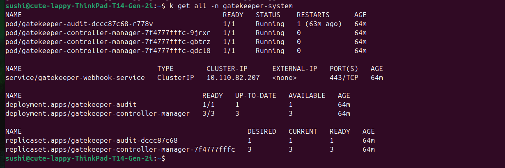

## Monitoring/Logging Setup

### System Monitoring

I am using _kube-prometheus-stack_ official helm chart to deploy our monitoring setup.

> I had faced problem scraping monitoring data while using minikube with _docker_ as runtime, so I changed the runtime to _containerd_ by creating new minikube cluster.

To setup ingress for prometheus and grafana, I enabled the ingress for them.

```sh
helm repo add prometheus-community https://prometheus-community.github.io/helm-charts
helm repo update
helm install prometheus prometheus-community/kube-prometheus-stack -n monitoring --values kubernetes/prometheus-stack/values.yaml
```

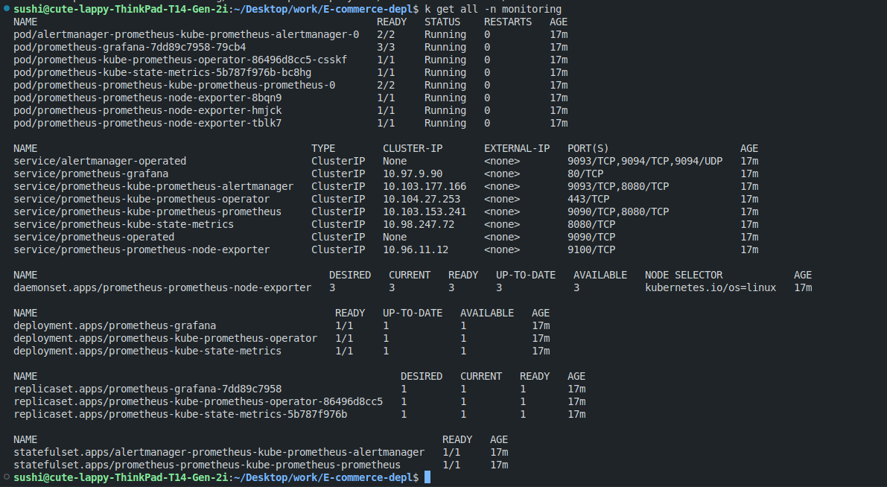

#### Cluster Metrics

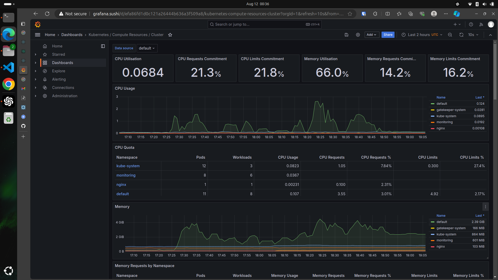

#### Frontend Metrics

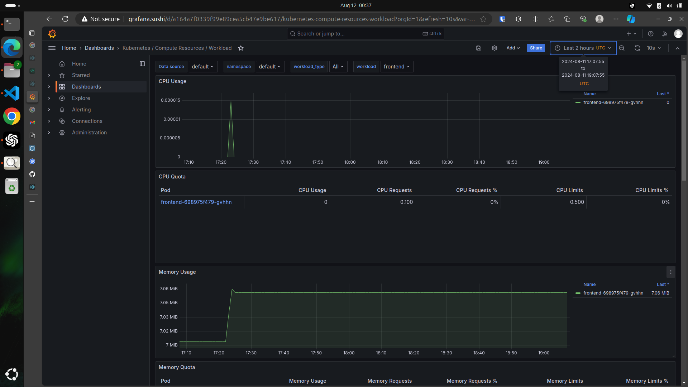

#### Backend Metrics

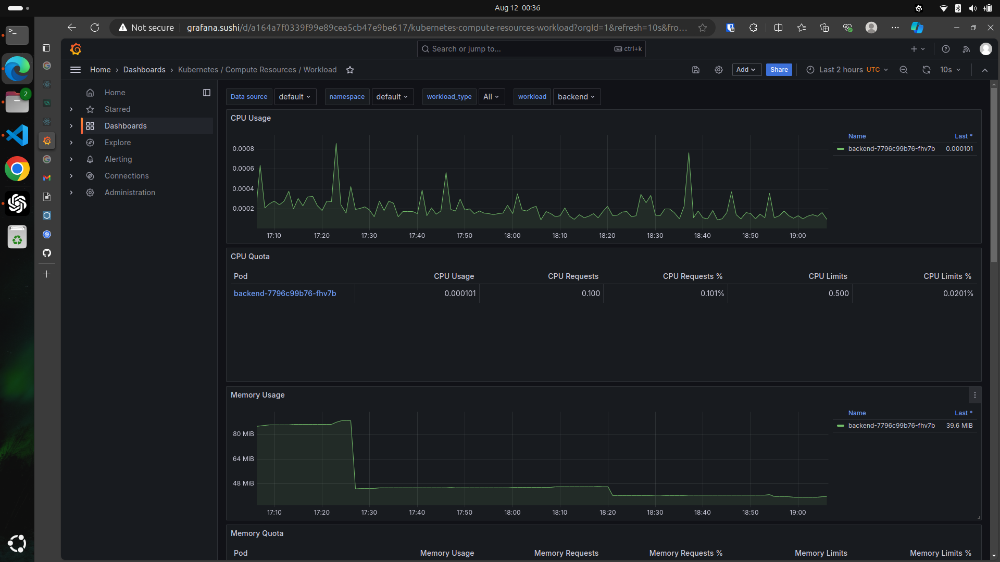

### Logs Monitoring

I have tried using the official helm charts but in my minikube cluster, the pods were facing problem while accessing the PVC and that's why I have created my own custom yaml files to deploy _elasticsearch_ with _kibana_, _logstash_ and _filebeat_ in our minikube.

```sh
cd kubernetes/ELK-stack/manifest/
kubectl apply -f elasticserach-depl.yaml
kubectl apply -f logstash-depl.yaml
kubectl apply -f filebeat-depl.yaml
kubectl apply -f kibana-depl.yaml
```

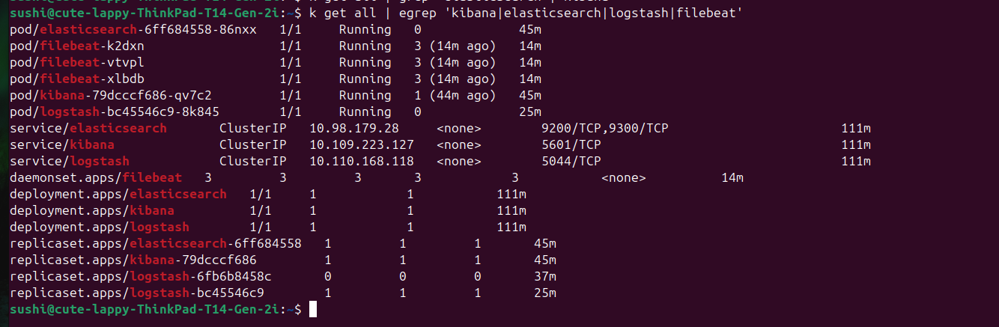

#### Kibana Demo

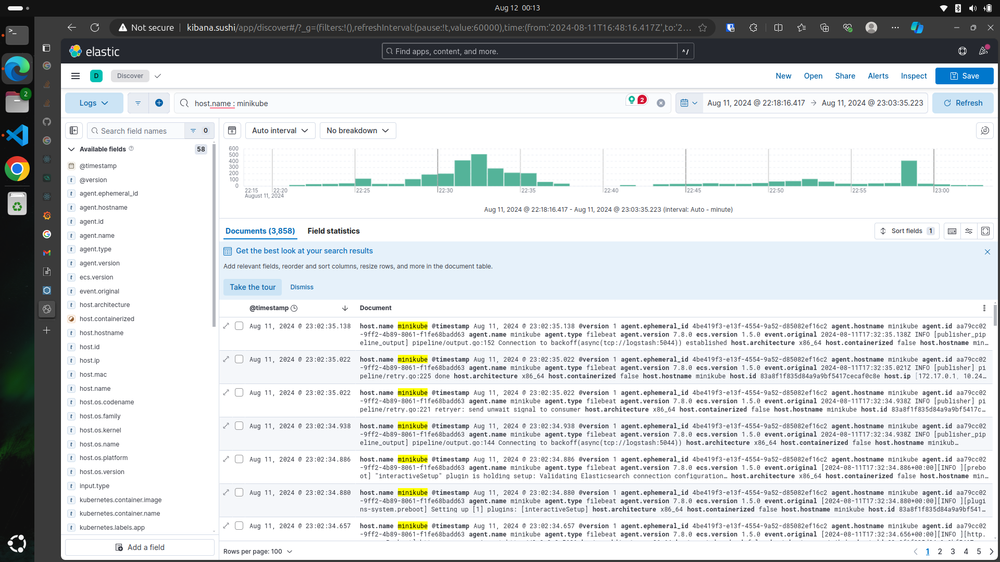

## Troubleshooting

1. **Frontend Accessibility**

   - Issue: The frontend service is not accessible externally post-deployment.
   - Steps:
     - First, we need to check what happens when we try to get the url of our frontend (http://frontend.sushi).
     - If it gives _NXDOMAIN_, i.e., domain can't be resolved then there's problem with the dns records for _frontend.sushi_. In my case, because it is a local setup I have added _frontend.sushi_, _backend.sushi_, _prometheus.sushi_, _grafana.sushi_ and _kibana.sushi_ in my **/etc/hosts** pointing to my ingress controller's _external IP_.
     - If it times out, then the request was not accepted by any service. In our case, the request never made it to the _nginx-controller_. Check the LoadBalancer service. (In my case, this happens when I forget to run _minikube tunnel_.)
     - If it gives Not Found or Connection Refused, our request this time made it to the nginx-controller. So, now we can see the nginx-controller's log to further understand what happened and fix this. (Probably check the Ingress rule/Service for mistakes.)
     - If log tells, the request to frontend service returned 503, then we have to check the frontend deployment logs for errors.

2. **Intermittent Backend-Database Connectivity**:

   - Issue: The backend services occasionally lose connection to the MongoDB cluster, causing request failures.
   - Steps:
     - First, we exec into one of the _backend_ pods and try running _curl http://mongo:27017_ to test connectivity.
     - We then check the deployment status of MongoDB.
     - Run \_kubectl top pod <mongo_pod_name> to check issues related to resource allocation.
     - Check the logs of _mongo_ for errors (Sometimes it may occur due to the connection timeout limits set in _mongo_).

3. **Order Processing Delays**:
   - Issue: Users report delays in order processing, suspecting issues with the RabbitMQ message queue.
   - Steps:
     - First, we check _backend_ logs why order requests are taking time. If there is connection issues with _RabbitMQ_ we need to debug and solve them first.
     - Exec into the _backend_ pod, try _curl_ and _ping_ to the _RabbitMQ_ service.
     - If everything seems fine, then delay is happening from RabbitMQ.
     - We open _RabbitMQ_ Management UI and check if everything is fine.
     - Then, we check _RabbitMQ_ logs for errors.
     - Check for resource related issues using _kubectl top_ command.
     - We can try to optimize the _RabbitMQ_ configurations like _durability_, _TTL_ and _max-length_.
