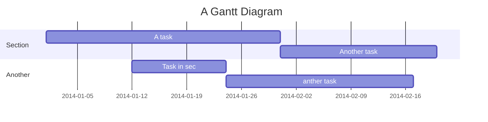

# E-Commerce Micro-service App on K8s


## Table of Contents

[TOC]

## Beginners Guide

If you are a total beginner to this, start here!

1. Visit hackmd.io
2. Click "Sign in"
3. Choose a way to sign in
4. Start writing note!

## Minikube On Linux

### Installation

To install minikube on a Linux system you can install the official binary using the following commands.

```sh
curl -LO https://storage.googleapis.com/minikube/releases/latest/minikube-linux-amd64
sudo install minikube-linux-amd64 /usr/local/bin/minikube && rm minikube-linux-amd64
```

> If you face any problem in the installation process, please checkout this link
> [minikube installation](https://minikube.sigs.k8s.io/docs/start/?arch=%2Flinux%2Fx86-64%2Fstable%2Fbinary+download).

### Starting Minikube

During this setup, I explored every **runtime driver** of minikube and found that each has its pros and cons.

While using _--container-runtime_ as **docker** I was facing problems while scraping _system metrics_ using **prometheus** and that's why I ended up using _containerd_ with an older version of _kubernetes_. Also, I have allocated more memory and CPU and disk space to my minikube because minikube got stuck if as it didn't have enough resources to spawn my pods.

```sh
minikube start \
    --nodes 3 \
    --cpus 4 \
    --memory 6GB \
    --disk-size 50GB \
    --container-runtime=containerd \
    --kubernetes-version=v1.28.3 \
    --bootstrapper=kubeadm \
    --extra-config=kubelet.authentication-token-webhook=true \
    --extra-config=kubelet.authorization-mode=Webhook \
    --extra-config=scheduler.bind-address=0.0.0.0 \
    --extra-config=controller-manager.bind-address=0.0.0.0
```

> The issue that I was facing the below issue while setting up prometheus in my minikube setup was this [Prometheus_issue](https://github.com/prometheus-community/helm-charts/issues/3614)

Aditionally, start the **_minikube tunnel_** (minikube tunnel runs as a process, creating a network route on the host to the service CIDR of the cluster using the cluster's IP address as a gateway. The tunnel command exposes the external IP directly to any program running on the host operating system) to allow our nginx ingress controller's external IP to work.

```sh
minikube tunnel
```

> Also, to work with kubernetes resources we have to install _kubectl_ if you don't installed it yet in your machine.

## Frontend Setup

I wrote a simple frontend using react which fetches the product list from the backend and provides users with **"Buy"** button on clicking which it sends a request to the backend to add an order to the message queue (_RabbitMQ_).

### Docker Image

#### Create the Dockerfile to build our frontend image.

- Inside the dockerfile, we need to do a _npm build_ of our app.
- Additionally, we need _nginx_ to serve the built static single-page app (_SPA_).
- Inside the dockerfile itself we need to set the backend hostname. If we don't specify any backend hostname it will by default work on **localhost:5000**.

```sh
cd frontend
docker build -t e-commerce-depl-frontend:<IMAGE_TAG> --build-arg BACKEND_HOSTNAME=<YOUR_BACKEND_HOSTNAME> .
```

#### Push the image to a registry

I used my DockerHub account for this project.

```sh
docker tag e-commerce-depl-frontend:<IMAGE_TAG> <YOUR_DOCKERHUB_USERNAME>/e-commerce-depl-frontend:<IMAGE_TAG>
docker push <YOUR_DOCKERHUB_USERNAME>/e-commerce-depl-frontend:<IMAGE_TAG>
```

## Backend Setup

For backend, I wrote a simple **_node.js_** app using _express_, _mongoose_ and _amqplib_.

It exposes 3 APIs.
| API | Method | Description |
| -------- | -------- | -------- |
| /api/seed | POST | Seeds the data with some prefilled data. |
| /api/producs | GET | Fetches the list of available products from the database. |
| /api/order | POST | Places the order of a product to the message queue (_RabbitMQ_). |

### Docker Image

Write a dockerfile to build your backend docker image and we simply do a npm build inside dockerfile and run index.js file using node package manager as entrypoint executable.

```sh
cd backend
docker build -t e-commerce-depl-backend:<IMAGE_TAG> .
docker tag e-commerce-depl-backend:<IMAGE_TAG> <YOUR_DOCKERHUB_USERNAME>/e-commerce-depl-backend:<IMAGE_TAG>
docker push <YOUR_DOCKERHUB_USERNAME>/e-commerce-depl-backend:<IMAGE_TAG>
```

```gherkin=
Feature: Guess the word

  # The first example has two steps
  Scenario: Maker starts a game
    When the Maker starts a game
    Then the Maker waits for a Breaker to join

  # The second example has three steps
  Scenario: Breaker joins a game
    Given the Maker has started a game with the word "silky"
    When the Breaker joins the Maker's game
    Then the Breaker must guess a word with 5 characters
```

> I choose a lazy person to do a hard job. Because a lazy person will find an easy way to do it. [name=Bill Gates]

```gherkin=
Feature: Shopping Cart
  As a Shopper
  I want to put items in my shopping cart
  Because I want to manage items before I check out

  Scenario: User adds item to cart
    Given I'm a logged-in User
    When I go to the Item page
    And I click "Add item to cart"
    Then the quantity of items in my cart should go up
    And my subtotal should increment
    And the warehouse inventory should decrement
```

> Read more about Gherkin here: https://docs.cucumber.io/gherkin/reference/

## User flows

```sequence
Alice->Bob: Hello Bob, how are you?
Note right of Bob: Bob thinks
Bob-->Alice: I am good thanks!
Note left of Alice: Alice responds
Alice->Bob: Where have you been?
```

> Read more about sequence-diagrams here: http://bramp.github.io/js-sequence-diagrams/

## Project Timeline



> Read more about mermaid here: http://mermaid-js.github.io/mermaid/

## Appendix and FAQ

:::info
**Find this document incomplete?** Leave a comment!
:::

###### tags: `Templates` `Documentation`

# Install Minikube on Linux

To install minikube on a Linux system you can install below binary

```sh
curl -LO https://storage.googleapis.com/minikube/releases/latest/minikube-linux-amd64
sudo install minikube-linux-amd64 /usr/local/bin/minikube && rm minikube-linux-amd64
```

If you face any problem in installation process checkout below link
[minikube installation](https://minikube.sigs.k8s.io/docs/start/?arch=%2Flinux%2Fx86-64%2Fstable%2Fbinary+download)

# Start Minikube

every version of minikube has some pros and cons in it. using --container-runtime as docker we are facing problem while scraping monitoring data using prometheus and grafana that's why we are using containerd with a older version of kubernetes. Also I have allocated more memory and CPU and disk space to my minikube because minikube got stuck if it doesn't have enough resources to spawn my pods.
I was facing the below issue while setting up prometheus in my minikube setup
[Prometheus_issue](https://github.com/prometheus-community/helm-charts/issues/3614)

```sh
minikube start \
    --nodes 3 \
    --cpus 4 \
    --memory 6GB \
    --disk-size 50GB \
    --container-runtime=containerd \
    --kubernetes-version=v1.28.3 \
    --bootstrapper=kubeadm \
    --extra-config=kubelet.authentication-token-webhook=true \
    --extra-config=kubelet.authorization-mode=Webhook \
    --extra-config=scheduler.bind-address=0.0.0.0 \
    --extra-config=controller-manager.bind-address=0.0.0.0
```

Aditionally start minikube tunnel {minikube tunnel runs as a process, creating a network route on the host to the service CIDR of the cluster using the cluster's IP address as a gateway. The tunnel command exposes the external IP directly to any program running on the host operating system} to allow our nginx ingress controller external IP to work.
Also to work with kubernetes resources we have to install kubectl if you don't installed it yet in your machine.

```sh
minikube tunnel
```

# Create a React frontend docker image

write a dockerfile to build your frontend docker image. Inside docker file we need to do a npm build of our and and additionally we need nginx to serve the frontend app. Inside our dockerfile it self we are setting up the backend hostname if you don't specify any backend hostname it will by default work on localhost:5000.

```sh
cd frontend
docker build -t e-commerce-depl-frontend:<IMAGE_TAG> --build-arg BACKEND_HOSTNAME=<YOUR_BACKEND_HOSTNAME> .
docker tag e-commerce-depl-frontend:<IMAGE_TAG> <YOUR_DOCKERHUB_USERNAME>/e-commerce-depl-frontend:<IMAGE_TAG>
docker push <YOUR_DOCKERHUB_USERNAME>/e-commerce-depl-frontend:<IMAGE_TAG>
```

# Create a node.js backend docker image

Write a dockerfile to build your backend docker image and we simply do a npm build inside dockerfile and run index.js file using node package manager as entrypoint executable.

```sh
cd backend
docker build -t e-commerce-depl-backend:<IMAGE_TAG> .
docker tag e-commerce-depl-backend:<IMAGE_TAG> <YOUR_DOCKERHUB_USERNAME>/e-commerce-depl-backend:<IMAGE_TAG>
docker push <YOUR_DOCKERHUB_USERNAME>/e-commerce-depl-backend:<IMAGE_TAG>
```

# My simple ecommerce server architecture

[add excalidraw image]

# Setup Nginx

Quickest way to setup nginx ingress controller is using helm charts we are using helm chart to deploy nginx in our minikube like below. Note without your minikube tunnel on your nginx controller external IP will stay on pending state.

```sh
helm repo add ingress-nginx https://kubernetes.github.io/ingress-nginx
helm repo update
helm install nginx ingress-nginx/ingress-nginx -n <YOUR_NAMESPACE>
```

you should see output like below
<PUT_IMAGE_HERE>

# Setup MongoDB

To setup our MongoDB we have used bitnami helm chart. Minikube act differently depends on the runtime environment we are using minikube with docker as runtime works file while creating any PVC but it will not work if you user your runtime as containerd. root cause analysis is still pending we use additional variable with helm chart which works in our case

```sh
helm install mongo bitnami/mongodb --set auth.username=<MONGODB_USER>,auth.password=<MONGODB_PASSWORD>,auth.database=<MONGODB_DATABASE>,volumePermissions.enabled=true
```

<PUT_IMAGE_HERE>

# Setup RabbitMQ

```sh
helm install rabbitmq bitnami/rabbitmq --set auth.username=<RABBITMQ_USER>,auth.password=<RABBITMQ_PASSWORD>,volumePermissions.enabled=true
```

<PUT_IMAGE_HERE>

# Create Database credential secret file

We create a secret to store our databases username and password in one place and we will be using this secret in our backend deployment file to access database username and password

```sh
kubectl create secret generic db-queue-cred \
  --from-literal=MONGO_USER=<MONGO_USER> \
  --from-literal=MONGO_PASSWORD=<MONGO_PASSWORD> \
  --from-literal=RABBITMQ_USER=<RABBITMQ_USER> \
  --from-literal=RABBITMQ_PASSWORD=<RABBITMQ_PASSOWRD>
```

# frontend and backend kubernetes manifests

We have created a deployment files for both app using my public dockerHub image you should replace the image with your dockerHub image repo and also set imagePullPolicy as always to pull images whenever a restart happen. Also created ClusterIP service and ingress file to server external request and user nginx as ingress class. Additionally created a HPA.yaml to automatically scale up pods incase of high traffic based on CPU utilization. We mount MongoDB and RabbitMQ credentials variables from the secret that we have created.

```sh
cd kubernetes
kubectl apply -f frontend/
kubectl apply -f backend/
```

you should see results like below
<PUT_IMAGE_HERE>
Note: If you have any problem in any installation process please check pods logs, you can also check logs or describe the deployment/statefulSet and check what is happening.

# Setup Gatekeeper

Gatekeeper is an admission controller that validates requests to create and update Pods on Kubernetes clusters, using the Open Policy Agent (OPA). Using Gatekeeper allows administrators to define policies with a constraint, which is a set of conditions that permit or deny deployment behaviors in Kubernetes.In our case we have setup a constrains which specifies if you do not specify resource limit {cpu usage and memory usage} for a pod Gatekeeper will not allow us to spawn that pod. we have a demo.yaml of a nginx pod you can verify your Gatekeeper using that file.

```sh
cd kubernetes/gatekeeper/
kubectl apply -f gatekeeper.yaml
kubectl apply -f require-resource-limit.yaml
kubectl apply -f resource-limit-contrains.yaml
```

<PUT_IMAGE_HERE>

# Setup Kube-prometheus-stack

We use kube-prometheus-stack official helm chart to deploy our monitoring setup. we have faced problem exporting monitoring data while using minikube with docker as runtime we changed the runtime to containerd by creating new minikube cluster it works fine with latest chart version. To setup ingress for prometheus and grafana we enable the ingress and specify ingressClass as nginx and also specified our host name.

```sh
helm repo add prometheus-community https://prometheus-community.github.io/helm-charts
helm repo update
helm install prometheus prometheus-community/kube-prometheus-stack -n monitoring --values kubernetes/prometheus-stack/values.yaml
```

# Setup ELK stack

We have tried using official helm charts but our minikube cluster was facing problem while accessing the PVC that's why we have created our won custom yaml files to deploy elasticsearch with kibana Logstash and Filebeat in our minikube.

```shell=
cd kubernetes/ELK-stack/manifest/
kubectl apply -f elasticserach-depl.yaml
kubectl apply -f logstash-depl.yaml
kubectl apply -f filebeat-depl.yaml
kubectl apply -f kibana-depl.yaml
```
